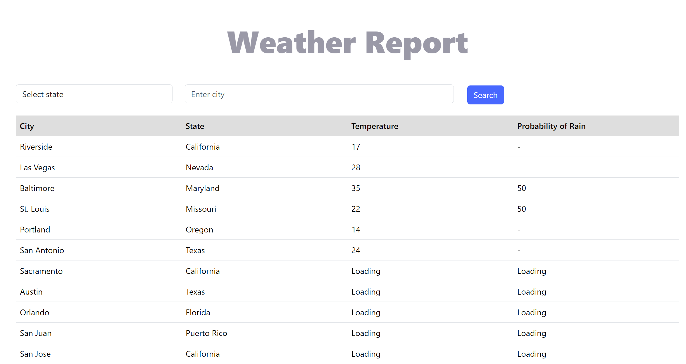
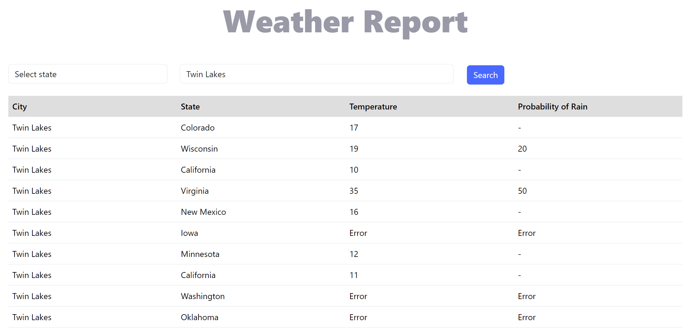
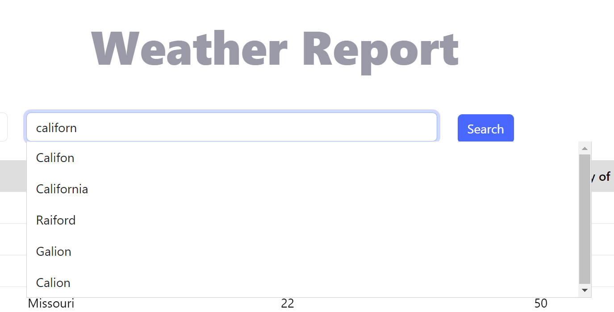
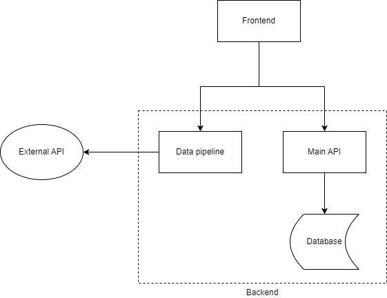

# Weather Report

## Overview

Weather Report is an API-driven web application that provides weather forecast data for American cities.

## Usage

Clone this repo and change to the project directory.

```bash
git clone https://github.com/Roy-j-Xu/Weather-Report.git
```

Set up developing environment.

```bash
./script.sh setup
```

To run the entire backend, run

```bash
./script.sh run
```

Or start each component individually:

```bash
# start main API
./mvnw spring-boot:run

# start ForecastAPI
venv/bin/activate
flask --app 'src\main\python\forecastAPI\app' run
```

The frontend is still under development, and can be started up by entering the command

````bash
npm run start
````

## Screenshots



<center>Weather data loading asynchronously</center>



<center>Searching and error handling
</center>



<center>Autocomplete</center>

## Documentation

### Architecture

The following diagram shows the overall structure of this project. 



### Components

- [**Main API**](docs/mainApi.md): A Rest-API created with Spring Boot. It handles searching and user-specific functionalities.
- [**Database**](docs/database.md): PostgreSQL database storing geographical data of cities and user information.
- [**Data Pipeline**](docs/dataPipeline.md): A Rest-API created with Flask. It aggregates and transforms external data, also serves as a facade for [external weather API](https://www.weather.gov/documentation/services-web-api).
- [**Frontend**](docs/frontend.md): Developed with (mostly) vanilla Typescript. 

## External links

- All forecast data are provided by [National Weather Service API](https://www.weather.gov/documentation/services-web-api)
- All diagrams are created with [drawio-desktop](https://github.com/jgraph/drawio-desktop). 