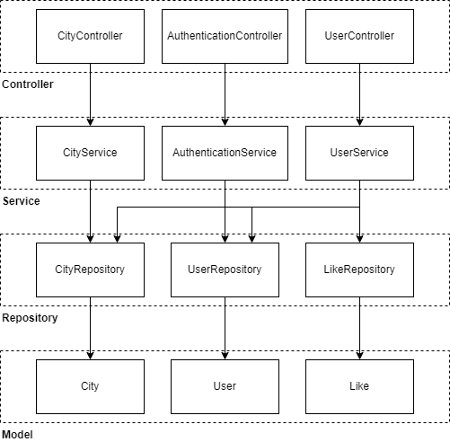

# Main API

A Rest-API created with Spring Boot, handling searching and user-specific functionalities. Source files for this component are located in `src\main\java\io\springboot\weatherreport\weatherreport`.

## Architecture

This API follows a typical structure for Spring Boot applications.

Dependency inversion is not applied for now.

## Specification

Once the Spring Boot program is running, the API will be located at `http://localhost:8080/api`.

#### Endpoints managed by `CityController`

- [Search for cities](api_specification/mainApi/cities.md): `GET /cities`.

- Get city: `GET /cities/{cityId}.`
- Get suggestions: `GET /cities/suggestions/{input}`.

#### Endpoints managed by `AuthenticationController`

- User signup: `POST /auth/signup`.
- User login: `POST /auth/login`.

#### Endpoints managed by `UserController`

- Like a city: `POST /users/likes/{userId},{cityId}`.
- Get liked cities: `GET /users/likes/{userId}`
